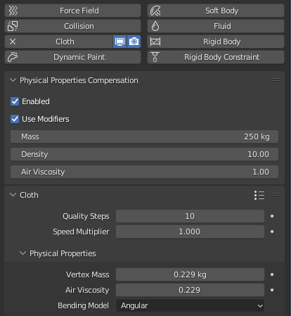

# Cloth Physical Properties Compensation
## Why?
When working with cloth simulations oftentimes we need to add extra subdivisions to improve
simulation quality. Unfortunatelly this causes the simulation to act completely different because
it depends on vertex mass.
 
This addon adds replacement settings for "Physical Properties" that will compensate for changes in 
vertex count and area.

## Examples
|  |  |
|---|---|
| Original | Subdivided |
|  |  |
| Subdivided using addon | Subdivided using addon + Subdivided after baking |

## Limitations
For this addon to work correctly you should have cloth simulation be the first one and uncheck 
"Use Modifiers" option or last and check "Use Modifiers" option. Another option would be to 
deactivate all extra modifiers when baking physics then disable compensation and reenable them.
